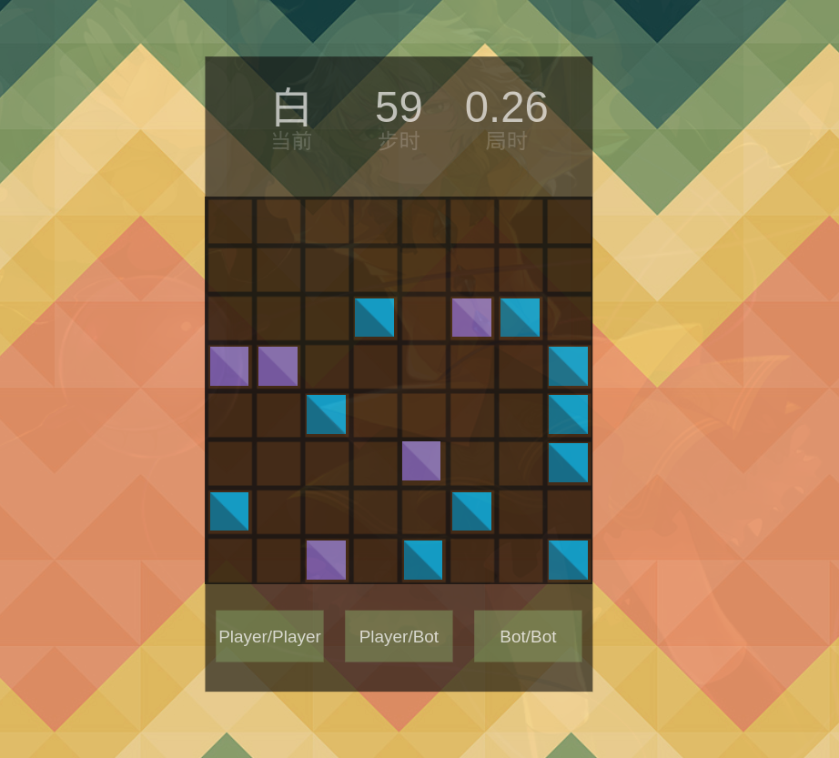

# LOA Frontend



# 关于LOA

* [Lines of Action - Wikipedia](https://en.wikipedia.org/wiki/Lines_of_Action)
* [How to play Lines of Action](https://www.youtube.com/watch?v=Nt0hQo0BBLg)

# 运行

```bash
$ git clone # ...
$ cd # ..
$ yarn install
$ yarn start # localhost:5140
```

# Bot接口

```typescript
export abstract class Bot {

	constructor(public readonly turn: number) { }

	abstract makeMove(board: number[]): { x0: number, y0: number, x1: number, y1: number }

}
```

* `turn`为0或1，代表Bot方执黑/白棋。
* `board[]`为长度为64的数组。例如上方示例图的棋盘，紫色为黑方，蓝色为白方：

```javascript
board = [
	-1, -1, -1, -1, -1, -1, -1, -1,
	-1, -1, -1, -1, -1, -1, -1, -1,
	-1, -1, -1,  1, -1,  0,  1, -1,
	 0,  0, -1, -1, -1, -1, -1,  1,
	-1, -1,  1, -1, -1, -1, -1,  1,
	-1, -1, -1, -1,  0, -1, -1,  1,
	 1, -1, -1, -1, -1,  1, -1, -1,
	-1, -1,  0, -1,  1, -1, -1,  1,
]
```

* 输出：from `(x0, y0)` to `(x1, y1)`，棋盘左上角为`(0, 0)`。

# Bot部署

* 在`src/bots`中新建`MyBot`类。
* 在`src/gamelogic`中修改`BotProvider = MyBot`。

# Bot调试

* 在Bot输出非法棋步时会判定对方胜利。
* 在`console`中可查看双方棋步，非法棋步会标记为红色。

